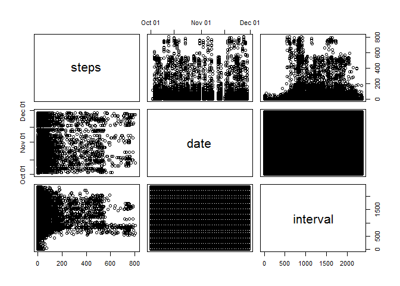
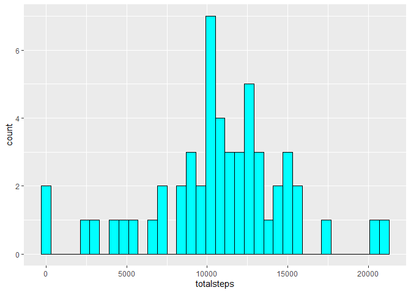
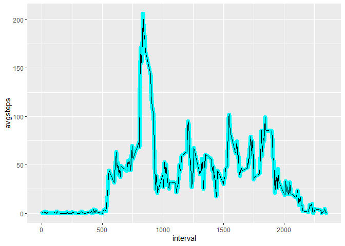
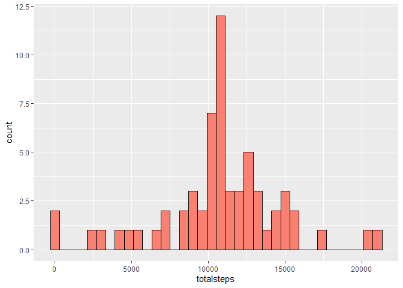
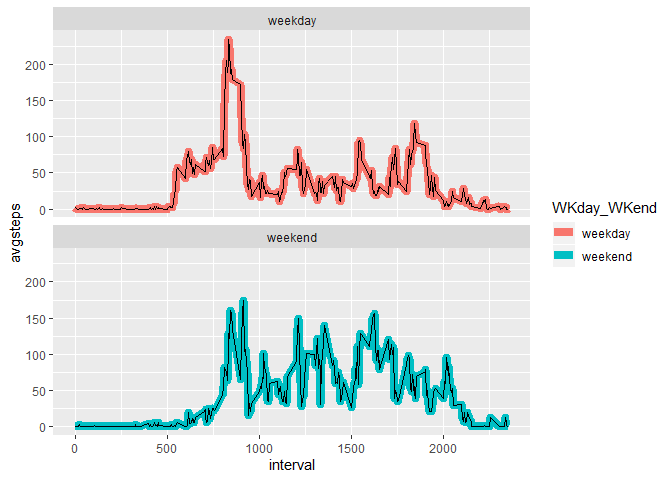

<hr/>

**Loading required packages...**

```r
library(ggplot2)
library(data.table)
```

<hr/>


## Loading and preprocessing the data

#### Show any code that is needed to:

<br/>

#### 1. Load the data (i.e. read.csv())

```r
if(!file.exists("activity.csv"))
        unzip("activity.zip")

activity <- read.csv("activity.csv")
```

<br/>

#### 2. Process/transform the data (if necessary) into a format suitable for your analysis
**converting to data.table, viewing activity structure**

```r
setDT(activity)
str(activity)
```

```
## Classes 'data.table' and 'data.frame':	17568 obs. of  3 variables:
##  $ steps   : int  NA NA NA NA NA NA NA NA NA NA ...
##  $ date    : Factor w/ 61 levels "2012-10-01","2012-10-02",..: 1 1 1 1 1 1 1 1 1 1 ...
##  $ interval: int  0 5 10 15 20 25 30 35 40 45 ...
##  - attr(*, ".internal.selfref")=<externalptr>
```

**converting "date" from factor type to continuous type, then confirming the changes**

```r
activity[  ,  date:=as.Date(date)  ]
str(activity)
```

```
## Classes 'data.table' and 'data.frame':	17568 obs. of  3 variables:
##  $ steps   : int  NA NA NA NA NA NA NA NA NA NA ...
##  $ date    : Date, format: "2012-10-01" "2012-10-01" ...
##  $ interval: int  0 5 10 15 20 25 30 35 40 45 ...
##  - attr(*, ".internal.selfref")=<externalptr>
```

**activity summary**

```r
summary(activity)
```

```
##      steps             date               interval     
##  Min.   :  0.00   Min.   :2012-10-01   Min.   :   0.0  
##  1st Qu.:  0.00   1st Qu.:2012-10-16   1st Qu.: 588.8  
##  Median :  0.00   Median :2012-10-31   Median :1177.5  
##  Mean   : 37.38   Mean   :2012-10-31   Mean   :1177.5  
##  3rd Qu.: 12.00   3rd Qu.:2012-11-15   3rd Qu.:1766.2  
##  Max.   :806.00   Max.   :2012-11-30   Max.   :2355.0  
##  NA's   :2304
```
**In column steps, we find that, there are 2304 NAs.**

**exploratory Plots**

```r
pairs(activity)
```

<!-- -->

**viewing activity contents**

```r
activity
```

```
##        steps       date interval
##     1:    NA 2012-10-01        0
##     2:    NA 2012-10-01        5
##     3:    NA 2012-10-01       10
##     4:    NA 2012-10-01       15
##     5:    NA 2012-10-01       20
##    ---                          
## 17564:    NA 2012-11-30     2335
## 17565:    NA 2012-11-30     2340
## 17566:    NA 2012-11-30     2345
## 17567:    NA 2012-11-30     2350
## 17568:    NA 2012-11-30     2355
```

<br/><br/>


## What is mean total number of steps taken per day?

#### For this part of the assignment, you can ignore the missing values in the dataset.

<br/>

#### 1. Calculate the total number of steps taken per day

```r
TOTAL <- activity[ , .( totalsteps = sum(steps), NAcount = sum(is.na(steps)) ) , by=date ]
tail(TOTAL)
```

```
##          date totalsteps NAcount
## 1: 2012-11-25      11834       0
## 2: 2012-11-26      11162       0
## 3: 2012-11-27      13646       0
## 4: 2012-11-28      10183       0
## 5: 2012-11-29       7047       0
## 6: 2012-11-30         NA     288
```
**"TOTAL" is a data-table containing total number of steps taken per day.**

<br/>

#### 2. If you do not understand the difference between a histogram and a barplot, research the difference between them. Make a histogram of the total number of steps taken each day

```r
ggplot(data = TOTAL) +
        geom_histogram(mapping = aes(x=totalsteps), binwidth = 600, colour="black", fill="cyan")
```

```
## Warning: Removed 8 rows containing non-finite values (stat_bin).
```

<!-- -->

<br/>

#### 3. Calculate and report the mean and median of the total number of steps taken per day
**mean** and **median** of total number of steps taken per day

```r
TOTAL[ , .( MeanSteps=mean(totalsteps, na.rm = TRUE) )  ]
```

```
##    MeanSteps
## 1:  10766.19
```

```r
TOTAL[ , .( MedianSteps=median(totalsteps, na.rm = TRUE) )  ]
```

```
##    MedianSteps
## 1:       10765
```

<br/><br/>


## What is the average daily activity pattern?

#### 1. Make a time series plot (i.e. type="l") of the 5-minute interval (x-axis) and the average number of steps taken, averaged across all days (y-axis)

**Lets calculate mean steps per interval & store it in "temp" data-table.**

```r
temp <- activity[ , .(avgsteps = mean(steps, na.rm = TRUE)) , by=interval ]
temp
```

```
##      interval  avgsteps
##   1:        0 1.7169811
##   2:        5 0.3396226
##   3:       10 0.1320755
##   4:       15 0.1509434
##   5:       20 0.0754717
##  ---                   
## 284:     2335 4.6981132
## 285:     2340 3.3018868
## 286:     2345 0.6415094
## 287:     2350 0.2264151
## 288:     2355 1.0754717
```

**Time series plot of temp data-table.**

```r
ggplot( data = temp, mapping = aes(x=interval, y=avgsteps) ) +
        geom_line(color="cyan", size=3) + geom_line()
```

<!-- -->

<br/>

#### 2.Which 5-minute interval, on average across all the days in the dataset, contains the maximum number of steps?

```r
temp[ avgsteps==max(avgsteps) ]
```

```
##    interval avgsteps
## 1:      835 206.1698
```
**835 is the needed time-interval. This agrees with the plot, where it shows the peak.**

<br/><br/>


## Imputing missing values

#### Note that there are a number of days/intervals where there are missing values (coded as NA). The presence of missing days may introduce bias into some calculations or summaries of the data.

<br/>

#### 1. Calculate and report the total number of missing values in the dataset (i.e. the total number of rows with NAs)

```r
activity[ , vapply(.SD, function(x) sum(is.na(x)), numeric(1)) ,  ]
```

```
##    steps     date interval 
##     2304        0        0
```
**Only steps has NAs.**

<br/>

#### 2. Devise a strategy for filling in all of the missing values in the dataset. The strategy does not need to be sophisticated. For example, you could use the mean/median for that day, or the mean for that 5-minute interval, etc.

**Lets look at temp data-table. It contains mean of every 5-minute interval.**

```r
temp
```

```
##      interval  avgsteps
##   1:        0 1.7169811
##   2:        5 0.3396226
##   3:       10 0.1320755
##   4:       15 0.1509434
##   5:       20 0.0754717
##  ---                   
## 284:     2335 4.6981132
## 285:     2340 3.3018868
## 286:     2345 0.6415094
## 287:     2350 0.2264151
## 288:     2355 1.0754717
```
**I choose to impute these values of avgsteps for NAs.**

<br/>

#### 3. Create a new dataset that is equal to the original dataset but with the missing data filled in.

**I choose to impute values of avgsteps for NAs. Those mean of every 5-minute interval need to be rounded off and converted to integer before imputation. This is because steps column of activity dataset is integer type.**

```r
activity_2 <- copy( activity )
s <- as.integer(round(temp$avgsteps))
activity_2[ is.na(steps) , steps:=rep( s, times=8) ]
```

**activity_2 is the new dataset with missing values filled in.**


```r
summary(activity_2)
```

```
##      steps             date               interval     
##  Min.   :  0.00   Min.   :2012-10-01   Min.   :   0.0  
##  1st Qu.:  0.00   1st Qu.:2012-10-16   1st Qu.: 588.8  
##  Median :  0.00   Median :2012-10-31   Median :1177.5  
##  Mean   : 37.38   Mean   :2012-10-31   Mean   :1177.5  
##  3rd Qu.: 27.00   3rd Qu.:2012-11-15   3rd Qu.:1766.2  
##  Max.   :806.00   Max.   :2012-11-30   Max.   :2355.0
```

<br/>

#### 4. Make a histogram of the total number of steps taken each day and Calculate and report the mean and median total number of steps taken per day. Do these values differ from the estimates from the first part of the assignment? What is the impact of imputing missing data on the estimates of the total daily number of steps?

**histogram plot**

```r
X_total <- activity_2[ , .(totalsteps=sum(steps)) , by=date ]

ggplot(data=X_total) +
        geom_histogram(mapping = aes(x=totalsteps), binwidth = 600, colour="black", fill="salmon")
```

<!-- -->

**mean** and **median** of total number of steps taken per day

```r
X_total[ , .( MeanSteps=mean(totalsteps, na.rm = TRUE) )  ]
```

```
##    MeanSteps
## 1:  10765.64
```

```r
X_total[ , .( MedianSteps=median(totalsteps, na.rm = TRUE) )  ]
```

```
##    MedianSteps
## 1:       10762
```

**mean** and **median** of previous assignment

```r
TOTAL[ , .( MeanSteps=mean(totalsteps, na.rm = TRUE) )  ]
```

```
##    MeanSteps
## 1:  10766.19
```

```r
TOTAL[ , .( MedianSteps=median(totalsteps, na.rm = TRUE) )  ]
```

```
##    MedianSteps
## 1:       10765
```

**Both mean and median have decreased but by negligible amounts only.**

<br/><br/>


## Are there differences in activity patterns between weekdays and weekends?

#### For this part the weekdays() function may be of some help here. Use the dataset with the filled-in missing values for this part.

<br/>

#### 1. Create a new factor variable in the dataset with two levels – “weekday” and “weekend” indicating whether a given date is a weekday or weekend day.

**Lets create a factor_weekdays vector as factor, but first create a vector containing the names of the weekdays**

```r
weekdays__ <- activity[ , weekdays(date) ]
factor_weekday <- factor(ifelse(weekdays__ %in% c("Saturday","Sunday"), "weekend", "weekday"))
```

**Now add the factor_weekday vector to activity dataset**

```r
activity[ , "WKday_WKend":=factor_weekday ]
activity
```

```
##        steps       date interval WKday_WKend
##     1:    NA 2012-10-01        0     weekday
##     2:    NA 2012-10-01        5     weekday
##     3:    NA 2012-10-01       10     weekday
##     4:    NA 2012-10-01       15     weekday
##     5:    NA 2012-10-01       20     weekday
##    ---                                      
## 17564:    NA 2012-11-30     2335     weekday
## 17565:    NA 2012-11-30     2340     weekday
## 17566:    NA 2012-11-30     2345     weekday
## 17567:    NA 2012-11-30     2350     weekday
## 17568:    NA 2012-11-30     2355     weekday
```

```r
str(activity)
```

```
## Classes 'data.table' and 'data.frame':	17568 obs. of  4 variables:
##  $ steps      : int  NA NA NA NA NA NA NA NA NA NA ...
##  $ date       : Date, format: "2012-10-01" "2012-10-01" ...
##  $ interval   : int  0 5 10 15 20 25 30 35 40 45 ...
##  $ WKday_WKend: Factor w/ 2 levels "weekday","weekend": 1 1 1 1 1 1 1 1 1 1 ...
##  - attr(*, ".internal.selfref")=<externalptr>
```

<br/>

#### 2. Make a panel plot containing a time series plot (i.e. type="l") of the 5-minute interval (x-axis) and the average number of steps taken, averaged across all weekday days or weekend days (y-axis). See the README file in the GitHub repository to see an example of what this plot should look like using simulated data.

**Subsetting as needed, then plotting**

```r
WKsteps <- activity[  , .(avgsteps=mean(steps, na.rm = TRUE)) ,  by=.(WKday_WKend,interval)]

ggplot(data = WKsteps, mapping = aes(x=interval,y=avgsteps)) +
        geom_line(mapping = aes(color=WKday_WKend), size=3) +
        facet_wrap( ~ WKday_WKend, ncol=1 ) + geom_line()
```

<!-- -->

<br/>

<center>
-----------------**THE END**-----------------
</center>

<br/><br/>
